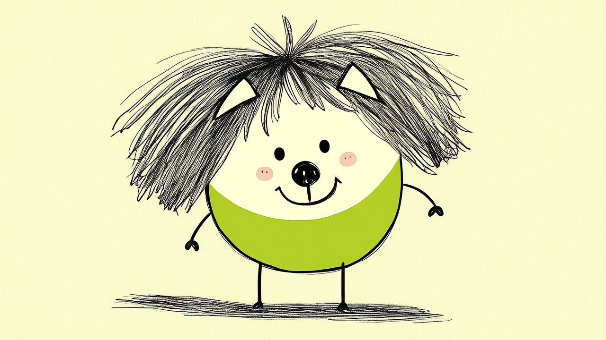

# Hand-Drawn Creature App



输入用户名 → 确定性生成一只铅笔手绘小生物：简笔线稿头、单色填色身体、小弧形手、棍子腿，带待机轻晃 / 跳跃 / 挥手动效，鼠标入画时脸部跟随移动。单文件 HTML，零依赖。

Deterministic hand-drawn creature generator: type a username, get a unique pencil-sketch creature with idle sway, jump/wave actions and mouse-following face. Single-file HTML, zero dependencies.

## 安装 / Install

通用 Agent skill（文件夹 + SKILL.md 格式），Codex、Claude Code、workBuddy、Trae 等都可以调用：

```bash
# 一键脚本安装到指定 Agent 的技能目录
bash install.sh ~/.agents/skills   # 通用 / workBuddy / Trae 等
bash install.sh ~/.codex/skills    # Codex
bash install.sh ~/.claude/skills   # Claude Code

# 或直接克隆
git clone https://github.com/Tree-oil/handdrawn-creature-app ~/.agents/skills/handdrawn-creature-app
```

## 快速开始 / Quick Start

```bash
cp assets/template-index.html ./index.html
python3 -m http.server 8765 --bind 127.0.0.1
# open http://127.0.0.1:8765/
```

输入任意名字即可生成唯一生物；同一名字永远得到同一只。

## Customize

所有定制点都在 `template-index.html` 的 `<script>` 内：

- `BODY_COLORS` 身体配色
- `EARS / HAIR / EYES / MOUTHS / ARMS / BROW` 特征取值数组，新增特征需补对应 `drawXxx` 分支
- `render()` 顶部的 `sway / headTilt / armIdle / hopY / armWave` 动效幅度与频率
- `tick()` 的 `actionT` 控制小动作间隔，`mouseleave / mouseOnScreen` 控制跟随与待机切换
- CSS 的 `h1 / .inputWrap` 控制布局

## 生成规则

名字 → FNV-1a 哈希 → mulberry32 伪随机数生成器 → 依次抽取特征。确定性生成，不是随机也不是写死。

## 示例输出

见 `examples/`（默认角色与 alex）。项目完整开发历史见 /Users/Code/Web/X-UI/who-are-you。
